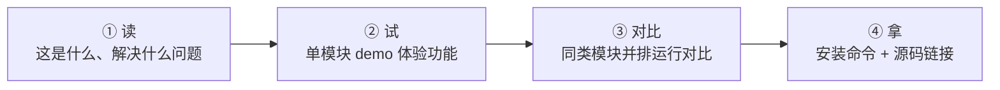

# 模块详情页重设计 — 「读 → 试 → 对比 → 拿」

## 设计目标
用户点进模块后，**30 秒内**能判断：这个模块是不是我要的。

## 核心流程



---

## ① 读 — 一屏说清楚

```
┌─────────────────────────────────────────────────┐
│  ← 返回                                    🌙   │
├─────────────────────────────────────────────────┤
│                                                 │
│  Ragas Evaluation                               │
│                                                 │
│  🎯 解决什么问题                                  │
│  你的 RAG 系统回答了用户问题，但你不知道回答质量      │
│  如何。这个模块能自动检测：回答有没有瞎编（幻觉）、    │
│  是否切题、检索的文档是否相关。                      │
│                                                 │
│  ✅ 适合你如果...                                 │
│  • 你有一个 RAG 系统，想量化回答质量                │
│  • 你需要自动化测试（不想人工逐条检查）              │
│  • 你想对比不同 prompt/模型的效果                  │
│                                                 │
└─────────────────────────────────────────────────┘
```

**要点：**
- 不用技术术语（faithfulness → 幻觉检测）
- 说问题而非功能（"你不知道回答质量" vs "提供评估指标"）
- 给出判断标准（"适合你如果..."）

---

## ② 试 — 单模块 Demo

用户先体验当前模块的功能。

### 模板 A：打分型（Ragas Evaluation / DeepEval）

```
┌─────────────────────────────────────────────────┐
│  📊 试一下：给一个 RAG 回答打分                     │
│                                                 │
│  场景：用户问了"什么是光合作用？"，你的系统           │
│  检索到了文档并生成了回答。看看回答质量如何？         │
│                                                 │
│  ┌─── 🔍 系统检索到的文档 ──────────────────────┐  │
│  │ [可编辑] 光合作用是植物利用光能将CO2和H2O...   │  │
│  └──────────────────────────────────────────────┘  │
│                                                 │
│  ┌─── 🤖 系统生成的回答 ──────────────────────┐   │
│  │ [可编辑] 光合作用是植物利用光能转化为有机物...  │  │
│  └──────────────────────────────────────────────┘  │
│                                                 │
│         [ ▶ 检测这个回答的质量 ]                    │
│                                                 │
│  ┌─── 📊 检测结果 ────────────────────────────┐   │
│  │  幻觉检测     ████████████░░  85%  ✅       │  │
│  │  是否切题     ██████████████  95%  ✅       │  │
│  │  文档相关性   ████████░░░░░░  60%  ⚠️       │  │
│  │                                              │  │
│  │  💡 文档相关性偏低，建议优化检索策略            │  │
│  └──────────────────────────────────────────────┘  │
└─────────────────────────────────────────────────┘
```

### 模板 B：生成型（Ragas Testset Generation）

```
┌─────────────────────────────────────────────────┐
│  📝 试一下：从文档自动生成测试题                     │
│                                                 │
│  把你的文档粘贴进来，看看能生成什么样的测试题。       │
│                                                 │
│  ┌─── 📄 你的文档内容 ─────────────────────────┐  │
│  │ [可编辑] 光合作用是植物利用光能将CO2和H2O...   │  │
│  └──────────────────────────────────────────────┘  │
│  生成数量：[3] 道题                               │
│                                                 │
│         [ ▶ 生成测试题 ]                          │
│                                                 │
│  ┌─── 📝 生成结果 ────────────────────────────┐   │
│  │  Q1. 光合作用的两个主要阶段是什么？            │  │
│  │  📎 参考答案：光反应和暗反应                   │  │
│  │  🏷️ 题型：单跳推理                           │  │
│  │                                              │  │
│  │  Q2. 光合作用主要发生在哪个细胞结构？           │  │
│  │  📎 参考答案：叶绿体                          │  │
│  │  🏷️ 题型：事实提取                           │  │
│  └──────────────────────────────────────────────┘  │
└─────────────────────────────────────────────────┘
```

**设计要点：**
- **场景化引导** — 先告诉用户这是什么场景
- **中文标签输入框** — "系统检索到的文档"，不是 `context`
- **可视化结果** — 进度条/卡片，不是 JSON
- **解读建议** — 告诉用户数字意味着什么

---

## ③ 对比 — 同类模块并排运行

> [!IMPORTANT]
> 这是核心差异化功能。不是文字对比表，而是**同一个输入，调多个 demo endpoint，结果并排展示**。

### 实现方式

利用已有的 `demoEndpoint`，对同 `category` 的模块并发请求：

```
┌─────────────────────────────────────────────────────────┐
│  🔄 对比：同样的输入，不同工具的检测结果                    │
│                                                         │
│  （使用上面你刚输入的数据）                               │
│                                                         │
│         [ ▶ 同时用 Ragas 和 DeepEval 检测 ]              │
│                                                         │
│  ┌── Ragas ───────────┐  ┌── DeepEval ──────────────┐  │
│  │                     │  │                          │  │
│  │ 幻觉  ████████ 85% │  │ 幻觉  ██████████ 92%    │  │
│  │ 切题  ██████░░ 60% │  │ 切题  ████████░░ 78%    │  │
│  │ 精确  ████████ 90% │  │ GEval █████████░ 88%    │  │
│  │                     │  │                          │  │
│  │ ⏱ 1.2s             │  │ ⏱ 2.1s                  │  │
│  └─────────────────────┘  └──────────────────────────┘  │
│                                                         │
│  💡 Ragas 更快、指标更专业；DeepEval 支持自定义评估标准    │
└─────────────────────────────────────────────────────────┘
```

### 技术实现

```typescript
// 前端逻辑（伪代码）
const sameCategoryModules = modules.filter(
  m => m.category === selectedModule.category 
    && m.id !== selectedModule.id 
    && m.demoEndpoint
)

// 点击对比按钮 → 并发调所有同类 endpoint
const results = await Promise.all(
  [selectedModule, ...sameCategoryModules].map(m =>
    fetch(`http://localhost:8100${m.demoEndpoint}`, {
      method: 'POST',
      body: JSON.stringify(currentPayload), // 复用用户刚输入的数据
    }).then(r => r.json())
  )
)
// 结果并排渲染
```

**不需要新建任何 endpoint**，复用现有的 demo API 即可。

---

## ④ 拿 — 迁移已拆好的模块

模块已经通过 repo-reuse-flow 拆解、解耦好了，用户直接迁移到自己的项目：

```
┌─────────────────────────────────────────────────┐
│  🚀 迁移到项目                                    │
│                                                 │
│  ┌─ 安装型 ─────────────────────────────────┐   │
│  │  pip install ragas                    📋  │   │
│  └───────────────────────────────────────────┘   │
│                                                 │
│  ┌─ 提取型（已拆好的模块包）─────────────────┐   │
│  │  📦 ragflow_common_1.0.0.zip     ⬇ 下载   │   │
│  │  包含：3 个核心类 · 2 个依赖              │   │
│  │  已解耦，可直接放入项目使用                │   │
│  └───────────────────────────────────────────┘   │
│                                                 │
│  源码：github.com/explodinggradients/ragas   ↗  │
└─────────────────────────────────────────────────┘
```

---

## 数据层变更

### 方案 A：改 CMS Schema（推荐）

在 Module collection 新增字段：

| 字段 | 类型 | 说明 |
|------|------|------|
| `problemStatement` | textarea | 🎯 解决什么问题（2-3 句，白话文） |
| `fitCriteria` | array of text | ✅ 适合你如果...（2-3 条） |
| `demoTitle` | text | demo 标题（如"给一个 RAG 回答打分"） |
| `demoScenario` | textarea | 场景说明（引导用户理解 demo 在做什么） |
| `demoInputLabels` | json | 输入字段 key→中文标签映射 |
| `demoResultType` | select | 结果展示类型：`scores` / `list` / `json` |

### 方案 B：前端硬编码（快速验证）

先在前端按 module slug 硬编码内容，验证 UX 后再迁移到 CMS。

---

## 实施计划

### Phase 1：单模块 Demo 模板（先做）
1. 重构详情页布局：读 → 试 → 拿
2. 实现两种 demo 渲染器：打分型 + 生成型
3. 先硬编码 Ragas Evaluation + Testset Gen 两个模块的内容
4. 验证 UX

### Phase 2：对比功能
1. 在 demo 区域下方加「对比同类模块」按钮
2. 实现并发请求 + 结果并排渲染
3. 每个 category 至少有 2 个模块可对比

### Phase 3：数据迁移
1. CMS Schema 加字段
2. 把硬编码内容迁移到 CMS
3. 其他模块按模板填充内容

---

> [!NOTE]
> **核心原则：让模块自己说话。**
> 用户不需要读文档、不需要懂技术名词。
> 点进来 → 看一句话介绍 → 试一下 → 跟同类对比 → 决定要不要用。
