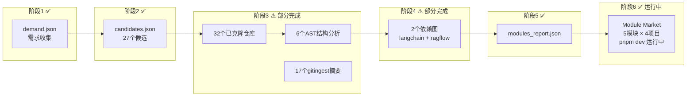
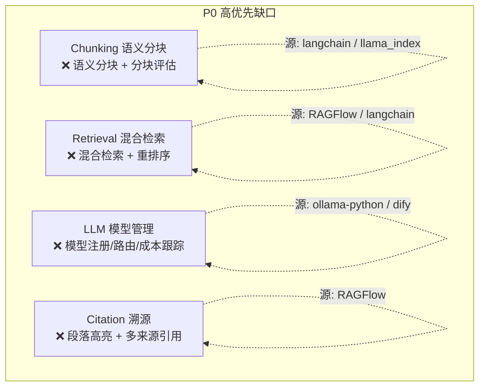

# 🗺️ 模块全景探索报告

> 基于 `module_landscape_demand.md` 的 14 类 53 功能需求，对照 `repo-reuse-flow` 流水线的当前进度，全面梳理模块覆盖率、缺口、和下一步行动。

---

## 一、流水线当前进度总览



### 关键数据

| 阶段 | 状态 | 详情 |
|------|------|------|
| ①需求 | ✅ 完成 | `demand.json` + `module_landscape_demand.md`（14类53功能） |
| ②搜索 | ✅ 完成 | 27个候选仓库（但搜索关键词偏泛，命中率有限） |
| ③克隆+分析 | ⚠️ 部分 | **已克隆 32个**，但 AST 结构分析只完成 6个 |
| ④依赖图 | ⚠️ 部分 | 完成 langchain + ragflow 的依赖图 |
| ⑤模块提取 | ✅ 安装型 | 通过 pip install 方式集成 ragas/deepeval/dspy/promptfoo |
| ⑥模块市场 | ✅ 运行中 | Payload CMS + Next.js 前端，5个模块已注册 |

---

## 二、需求 × 模块覆盖矩阵

根据 `module_landscape_demand.md` 的 14 类模块需求，逐一对照已有模块和候选源：

### 数据层 (4 模块)

| # | 模块 | 需求状态 | 已有覆盖 | 候选源仓库 | 优先级 |
|---|------|---------|---------|-----------|--------|
| 1 | **Document** — 文档处理 | ✅ 3/4 功能已有 | MinerU ✅ (已克隆) | MinerU, DocLayout-YOLO | 🟡 低 |
| 2 | **Chunking** — 文本分块 | ⚠️ 1/4 已有 | 基础版 | **langchain** (text_splitters), **llama_index** (node_parser) | 🔴 高 |
| 3 | **Embedding** — 向量化 | ⚠️ 0/4 完整 | 基础版 | **langchain** (embeddings), **llama_index** (embeddings) | 🟡 中 |
| 4 | **Knowledge** — 知识库管理 | ⚠️ 0/4 完整 | 基础版 | **RAGFlow** (knowledge mgmt), **dify** (datasets) | 🟡 中 |

### 检索层 (4 模块)

| # | 模块 | 需求状态 | 已有覆盖 | 候选源仓库 | 优先级 |
|---|------|---------|---------|-----------|--------|
| 5 | **Auth** — 认证/角色 | ✅ 3/3 | Payload CMS 内置 | — | ⚪ 无需 |
| 6 | **Question** — 问题处理 | ⚠️ 1/4 | Ragas Testset Gen ✅ | **dspy** (query processing), **langchain** (query transform) | 🟡 中 |
| 7 | **Retrieval** — 检索策略 | ⚠️ 1/5 | 向量检索已有 | **RAGFlow** (hybrid search), **langchain** (retrievers) | 🔴 高 |
| 8 | **Citation** — 溯源定位 | ⚠️ 0/4 完整 | MinerU bbox 元数据 | **RAGFlow** (document referring) | 🔴 高 |

### 生成层 (3 模块)

| # | 模块 | 需求状态 | 已有覆盖 | 候选源仓库 | 优先级 |
|---|------|---------|---------|-----------|--------|
| 9 | **Prompt** — Prompt管理 | ⚠️ 1/4 | DSPy Signatures ✅, Ragas Prompt ✅ | **dify** (prompt presets), **open-webui** (prompts) | 🟡 中 |
| 10 | **LLM** — 模型管理 | ❌ 0/4 | 无 | **ollama-python** ✅已克隆, **dify** (model_runtime) | 🔴 高 |
| 11 | **Cache** — 缓存 | ❌ 0/3 | 无 | **GPTCache** (未克隆), **langchain** (caching) | 🟡 中 |

### 质量层 (3 模块)

| # | 模块 | 需求状态 | 已有覆盖 | 候选源仓库 | 优先级 |
|---|------|---------|---------|-----------|--------|
| 12 | **Evaluation** — 评估 | ✅ 3/4 | Ragas ✅, DeepEval ✅, Promptfoo ✅ | — | ⚪ 已覆盖 |
| 13 | **Report** — 报告 | ❌ 0/3 | 无 | **langfuse** ✅已克隆, **evidently** ✅已克隆 | 🟡 中 |
| 14 | **Chart** — 可视化 | ❌ 0/3 | 无 | **phoenix** ✅已克隆, **langfuse** | 🟡 中 |

---

## 三、已有资产清单

### 🏪 Module Market 已注册 (5 个模块)

| 模块 | 来源项目 | 类型 | 类别 | 复用评分 |
|------|---------|------|------|---------|
| Ragas Evaluation | explodinggradients/ragas | 📦 安装型 | evaluation | 0.95 |
| Ragas Testset Gen | explodinggradients/ragas | 📦 安装型 | question-gen | 0.90 |
| Ragas Prompt Framework | explodinggradients/ragas | 📦 安装型 | prompt-mgmt | 0.85 |
| DeepEval | confident-ai/deepeval | 📦 安装型 | evaluation | 0.92 |
| DSPy Signatures | stanfordnlp/dspy | 📦 安装型 | prompt-mgmt | 0.88 |
| Promptfoo | promptfoo/promptfoo | 📦 安装型 | evaluation | 0.93 |

### 📊 AST 结构分析已完成 (6 个)

| 仓库 | 结构文件 | 大小 |
|------|---------|------|
| langchain | langchain_structure.json | 3.4 MB |
| ragas | ragas_structure.json | 2.2 MB |
| ragflow | ragflow_structure.json | 1.6 MB |
| dspy | dspy_structure.json | 141 KB |
| ollama-rag | ollama-rag_structure.json | 12 KB |
| langchain (测试) | langchain_ast_test.json | 185 KB |

### 🔗 依赖图已构建 (2 个)

| 仓库 | 依赖图文件 | 大小 |
|------|----------|------|
| langchain | langchain_depgraph.json | 180 KB |
| ragflow | ragflow_depgraph.json | 78 KB |

### 📦 已克隆但尚未分析 (26 个)

以下仓库已克隆到 `outputs/03_analysis/cloned/` 但尚未进行 AST 分析：

| 仓库 | 与需求关联 | 分析价值 |
|------|-----------|---------|
| **dify** | LLM管理, Prompt管理, 知识库 | ⭐⭐⭐ 极高 — 覆盖多个需求模块 |
| **llama_index** | Chunking, Embedding, Retrieval | ⭐⭐⭐ 极高 |
| **open-webui** | Prompt管理, LLM管理 | ⭐⭐ 高 |
| **langfuse** | Report, Chart, 可视化 | ⭐⭐ 高 |
| **phoenix** | Chart, Dashboard | ⭐⭐ 高 |
| **evidently** | Report, 数据质量 | ⭐⭐ 高 |
| **MinerU** | Document (已集成) | ⭐ 中 |
| **DocLayout-YOLO** | Document (版面分析) | ⭐ 中 |
| **deepeval** | ✅ 已在市场 | ⚪ 已完成 |
| **langgraph** | Agent workflow | ⭐ 中 |
| **langsmith-sdk** | Tracing | ⭐ 中 |
| fastapi, react, tailwindcss, payload, ui | 基础设施，非RAG模块 | ⚪ 不需要 |
| ML-For-Beginners, Web-Dev-For-Beginners, etc. | 教程类，非代码模块 | ⚪ 不需要 |

---

## 四、缺口分析 — 6 个高优先模块

根据覆盖矩阵，以下 6 个模块是当前最大缺口：

### 🔴 P0 — 必须尽快补齐



| 模块 | 缺失功能 | 推荐来源 | 方式 |
|------|---------|---------|------|
| **Chunking** | 语义分块、分块评估 | langchain `text_splitters`、llama_index `node_parser` | 📦 安装型 |
| **Retrieval** | 混合检索、重排序 | RAGFlow `rag/`、langchain `retrievers` | 🔧 RAGFlow 提取型 + LangChain 安装型 |
| **LLM** | 模型注册、路由、成本跟踪 | ollama-python + dify `model_runtime` | 📦 安装型 (ollama) + 🔧 提取型 (dify) |
| **Citation** | 段落高亮、BBox定位 | RAGFlow `document_referring` | 🔧 提取型 |

### 🟡 P1 — 后续批次

| 模块 | 缺失功能 | 推荐来源 |
|------|---------|---------|
| **Cache** | 语义缓存、Embedding缓存 | GPTCache（需新克隆）、langchain caching |
| **Report** | 评估报告、版本对比 | langfuse、evidently |
| **Chart** | 评分趋势、雷达图 | phoenix、langfuse dashboard |
| **Knowledge** | 元数据管理、知识图谱 | RAGFlow、dify |

---

## 五、下一步行动建议

### Step 1: 对高价值已克隆仓库做 AST 分析

以下仓库已克隆但未做 AST 分析，覆盖多个 P0 缺口：

```powershell
cd c:/Users/40270/.workbuddy/skills/repo-reuse-flow

# llama_index — Chunking + Embedding + Retrieval
.venv\Scripts\python.exe scripts/analyze_repo.py outputs/03_analysis/cloned/llama_index -o outputs/03_analysis/structures/llama_index_structure.json

# dify — LLM + Prompt + Knowledge
.venv\Scripts\python.exe scripts/analyze_repo.py outputs/03_analysis/cloned/dify -o outputs/03_analysis/structures/dify_structure.json

# open-webui — Prompt + LLM
.venv\Scripts\python.exe scripts/analyze_repo.py outputs/03_analysis/cloned/open-webui -o outputs/03_analysis/structures/open-webui_structure.json

# langfuse — Report + Chart
.venv\Scripts\python.exe scripts/analyze_repo.py outputs/03_analysis/cloned/langfuse -o outputs/03_analysis/structures/langfuse_structure.json
```

### Step 2: 构建依赖图 + 模块检测

```powershell
# 对分析完的结构构建依赖图
.venv\Scripts\python.exe scripts/build_dep_graph.py outputs/03_analysis/structures/llama_index_structure.json -o outputs/04_depgraph/llama_index_depgraph.json
```

### Step 3: 从 RAGFlow 提取 Retrieval + Citation 模块

RAGFlow 已有依赖图，可以直接用需求驱动提取：

```powershell
# 预览 RAGFlow 的检索模块
.venv\Scripts\python.exe scripts/extract_feature_module.py --repo outputs/03_analysis/cloned/RAGFlow --entry rag --name retrieval --preview

# 预览 RAGFlow 的文档溯源模块  
.venv\Scripts\python.exe scripts/extract_feature_module.py --repo outputs/03_analysis/cloned/RAGFlow --entry document_referring --name citation --preview
```

### Step 4: 注册新模块到 Module Market

对每个新提取/安装的模块，在 `seed-modules.ts` 中添加条目并运行 seed。

---

## 六、覆盖率仪表盘

```
数据层  ████████░░░░░░░░ 50%  (Document ✅, Chunking ⚠️, Embedding ⚠️, Knowledge ⚠️)
检索层  ████████████░░░░ 75%  (Auth ✅, Question ⚠️✅, Retrieval ❌, Citation ❌)
生成层  ████████░░░░░░░░ 50%  (Prompt ✅✅, LLM ❌, Cache ❌)
质量层  ████████████░░░░ 75%  (Evaluation ✅✅✅, Report ❌, Chart ❌)

总体：13/53 功能已覆盖 = 25%
模块市场已注册：6 个模块 / 14 类目标
```

> [!IMPORTANT]
> **关键发现**: 质量层（Evaluation）覆盖最好（3/4），但核心 RAG 管道（Chunking → Retrieval → LLM）的缺口最大。建议优先补齐 **Chunking + Retrieval + LLM** 这条主线。

> [!TIP]
> **最高 ROI 操作**: 对 `llama_index` 和 `dify` 做 AST 分析 — 这两个仓库可以同时覆盖 Chunking、Embedding、Retrieval、LLM、Knowledge 5 个缺口模块。
